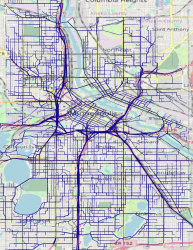

Overview
==============================

Trajectory Generator aims to produce large synthetic datasets of vehicle trajectories, where each trajectory is a sequence of GPS points. Such datasets are helpful to evaluate algorithms' performance or train/test machine learning and deep learning models.

Methodology
=============================
Trajectory Generator uses a practical and straightforward approach to simulate and generate trajectories. In particular, it performs the following steps:

1. Start by downloading the road network G for the area of interest (e.g., NYC) from [OpenStreetMap](http://openstreetmap.org/). 

2. Select a random pair of nodes from G to serve as the source and destination of the trajectory to be generated.

3. Identify the shortest path between these two nodes in G. This path serves as the route traveled by the vehicle.

4. Sample GPS points every x meters along the route.

5. Add a Gaussian (normally distributed) noise for these GPS points. 

6. Repeat steps 2-5 for the number of desired trajectories.

Credit to [Dr. Sofiane Abbar](https://mobile.twitter.com/sofianeabbar) for this approach.

How to Use Trajectory Generator
==========

## 1- Install Dependencies:
You can create a virtual environment using [`venv`](https://docs.python.org/3/library/venv.html) or [`Conda`](https://docs.conda.io/projects/conda/en/latest/user-guide/tasks/manage-environments.html) if you prefer. Please refer to their documentation for details regarding creating a new environment. Then run the following

    pip install -r requirements.txt

Note that at the time of writing, Trajectory Generator support **Python<=3.7** due to 
some dependencies ([Ray](https://www.ray.io/)) that currently do not support Python>3.7

## 2- Update the Configuration:

Edit the parameters in `config.py` file. Below is an example configuration and description of these parameters.

    place = 'Minneapolis, Minnesota, USA'
    count = 10000
    per_file = 1000000
    output_dir = 'simulated_trajectories' 

| Parameter   |Type    | Description |
| ----------- | --     |------------ |
| place       | String | Area of interest where the generated trajectories will be generated. Names are geocoded using [Nominatim](https://wiki.openstreetmap.org/wiki/Nominatim). |
| count       | Number | Total number of trajectories to be generated in all files.  |
| per_file   | Number  | Maximum number of trajectories in a single file. |
| output_dir | String  | Path of the output directory. |

## 3- Run:
    python driver.py

Output Format
===
The output is a set of CSV files (compressed in gzip format). Each row is a single trajectory with seven comma-separated fields. These fields are as follows:

| Field      | Description                                                                                                                 |
| -----------|---------------------------------------------------------------------------------------------------------------------------- |
|trj_id      | Sequential numeric ID starts from 1 and continues through all generated trajectories (across all files) until `count-1`.    |
|pickup_lon  | Longitude of the trajectory starting point (source node).                                                                   |
|pickup_lat  | Latitude of the trajectory starting point (source node).                                                                    |
|dropoff_lon | Longitude of the trajectory ending point (destination node).                                                                |
|dropoff_lat | Latitude of the trajectory ending point (destination node).                                                                 |
|lons        | List of longitudes of the intermediate GPS points, separated by a single white space ' '.                                   |
|lats        | List of Latitudes of the intermediate GPS points, separated by a single white space ' '.                                    |

Other Notes
===
- Trajectories generated have a sequence of GPS points only without timestamps. Contributions to this and other features are welcome.
- This Trajectory Generator uses [Ray](https://www.ray.io/) for scalability and multiprocessing. Specifically, it creates a number of [actors](https://docs.ray.io/en/latest/ray-core/actors.html) equal to the number of available CPUs, where each actor independently generates trajectories. The main process collects these generated trajectories and writes them to files. 

Contributions
==

Contributions by reporting issues, suggesting/adding features, or fixing bugs are highly welcomed. Please submit an issue or pull request to contribute.